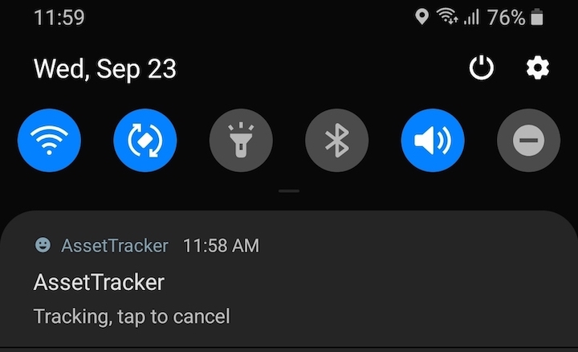

# AssetTracker
Small android app to track an asset using GPS.
## Compile
* Build with android studio 4.
* Firebase configurations are mine and could be offline anytime, replace with yours if you experienced any connection issue.
## Installation
* Install AssetTracker at asset location. currently support tracking 1 asset at a time.
* Then open AssetTrackingDisplay at user's end to locate the assets.
## Run
* Asset's end.

* User's end, red marker indicating asset's location.

